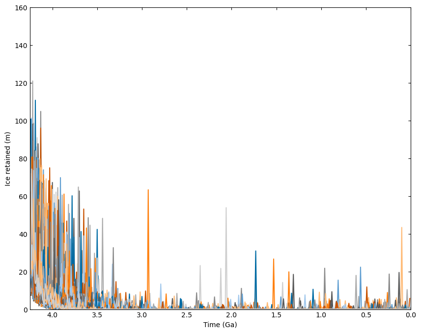
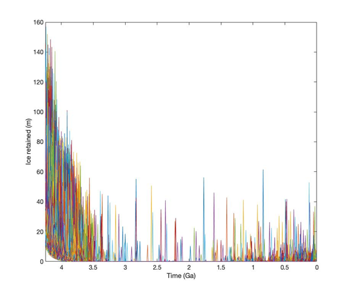

# MoonPIES: Moon Polar Ice and Ejecta Stratigraphy

Welcome to the *Moon Polar Ice and Ejecta Stratigraphy* (MoonPIES) model. This document will outline how to install, configure, and run the MoonPIES model.

## Motivation

MoonPIES investigates ice and ejecta at depth within lunar polar coldtraps. As the Artemis program prepares resume human exploration of the Moon with the lunar South Pole being the primary target, it is important to understand potential ice deposits in south polar permanently shadowed regions.

A recent model of lunar cold trap stratigraphy suggested that "gigaton ice deposits" may be preserved at depth (Cannon et al. 2020). Here, we augment the Cannon et al. 2020 model to:

- Include the effects of *ballistic sedimentation*
- Update the treatment of *impact gardening*
- Add *basin impactors*

MoonPIES is intended to be runnable out of the box. Parameters are easy to tweak for a given run since our understanding of lunar polar ice is rapidly evolving. The Monte Carlo model is also designed to be reproducible such that a particular set of inputs will always produce the same outputs when run on a particular model version.

Below are step-by-step instructions for installing and running the model. For help getting started, please contact Christian at [cjtu@nau.edu](mailto:cjtu@nau.edu).

## Model prerequisites

- python 3.6+ (python 3.8+ recommended)
- numpy
- pandas
- matplotlib

The model had been tested on all main operating systems (Linux/Mac/Windows). We recommend installing python and the above packages using [Anaconda](https://www.anaconda.com/products/individual) or [Miniconda](https://docs.conda.io/en/latest/miniconda.html).

Once Anaconda or Miniconda are installed, the requisite packages can be installed from a terminal or command prompt with:

`conda install numpy pandas matplotlib`

To make a separate MoonPIES environment, you can run:

`conda create -n moonpies python=3.8 numpy pandas matplotlib`

And then activate the environment on each login with:

`conda activate moonpies`

See more info about managing conda environments [here](https://conda.io/projects/conda/en/latest/user-guide/tasks/manage-environments.html) or refer to this [conda env tutorial](https://cjtu.github.io/spirl/anaconda_environments.html).

**Note:** While the model will run on Windows, we recommend Windows users install the Windows Subsystem for Linux (WSL), particularly to simplify running the model in parallel. See WSL installation guide [here](https://docs.microsoft.com/en-us/windows/wsl/install-win10).

## Model Installation

The model is packaged as a `.zip` file and can be downloaded from *TBD*. Once downloaded, extract all contents of the `.zip` to a directory of your choice (e.g. by right-clicking the .zip and choosing "extract here"). The unzipped package has the following structure:

```bash
moonpies_package/
|- data/
|  |- costello_etal_2018_t1.csv
|  |- crater_list.csv
|  |- needham_kring_2017.csv
|- figures/
|- moonpies/
|  |- default_config.py
|  |- moonpies.py
|  |- my_config.py
|- test/
|  |- test_moonpies.py
|- README.md
```

## Running the model

### Default configuration

To run the model, open a terminal (Mac/Linux/WSL) or command prompt (Windows) and navigate to the `moonpies_package/` directory:

`cd /path/to/moonpies_package/`

For help navigating the terminal, see the following [cheatsheet](https://enexdi.sciencesconf.org/data/pages/windows_vs_mac_commands_1.pdf).

Now you can run the model in its default configuration mode using the following command:

`python main.py`

The model will run and write outputs to the `moonpies_package/data/` directory. Outputs are saved by today's date, the run name, and the random seed (e.g. `data/yymmdd_run/#####`, where `#####` is the 5-digit random seed used. For example, after running the model once, the data folder will look similar to the following:

```bash
moonpies_package/
|- data/
|  |- 210706_mpies/
|  |  |- 85637/
|  |  |  |- ej_columns_mpies.csv
|  |  |  |- ice_columns_mpies.csv
|  |  |  |- config_mpies.py
|  |  |  |- strat_Amundsen.csv
|  |  |  |- strat_Cabeus B.csv
|  |  |  |- strat_Cabeus.csv
|  |  |  |- ...
|  |- bahcall_etal_2001_t2.csv
|  |- ballistic_hop_coldtraps.csv
|  |- ...
...
```

### Custom random seed

A particular random seed can be set as a MoonPIES argument as a number following `main.py`:

`python main.py 12345`

The seed can be any integer from 1 to 99999 (5-digits max). If no seed is specified, it is randomly chosen. Specifying the random seed allows you to reproduce prior model runs as long as an identical configuration is also used.

### Custom configuration

All parameters to `main.py` can be modified in a configuration file and passed as an argument. The `my_config.py` file in the `moonpies/` directory is an template which you may edit or copy to produce custom `config.py` files.

**Warning**: The `default_config.py` file contains the default parameters and should never be modified directly. However, `default_config.py` may be a useful reference for descriptions and units of all model parameters.

To run the model with a custom configuration, specify the `--cfg` or `-c` flag followed by the path to a custom `config.py` file:

`python main.py --cfg my_config.py`

**Note:** If the seed and config file are both specified, the cmd-line seed will always take precedence. E.g., `12345` will be the random seed even if `seed` is defined in my_config.py.

`python main.py 12345 my_config.py`

If no random seed is specified, the model will first look for a `seed` field in `my_config.py` and then fall back on randomly choosing a seed as in the default case.

**Note:** Since model runs with the same `run_name` and `seed` will be written to the same directory, you may overwrite outputs if you change configurations without changing the name. We recommend that each new configuration has its own `config.py` file defined and a unique `run_name` selected to avoid output conflicts.

## Running in parallel (Linux/Mac/WSL only)

MoonPIES is compatible with [GNU parallel](https://www.gnu.org/software/parallel/) which allows many random trials to be run in parallel (Tange, 2011).

GNU parallel is available from most UNIX package managers and can be installed from a terminal with:

```bash
apt install parallel  # Ubuntu / WSL
brew install parallel  # MacOS
```

**Note:** On MacOS, you may need to install homebrew first (see [brew.sh](https://brew.sh/)).

Now, many iterations of the model may be run in parallel with a simple command:

`seq 1000 | parallel -P-1 python main.py`

This example will start 1000 runs of MoonPIES, each with a unique random seed and output directory so that no data is overwritten. To configure your `parallel` runs:

- The number of runs is given by the `seq N` parameter.
- The system resources to use are given by the `-P` flag. By default, `parallel` will use all available cores on your system. In the command above `-P-1` instructs parallel to use all cores except one (`P-2` would use all cores except 2, etc).

## Plotting outputs

`MoonPIES` provides some functions to help visualize model outputs.

### Ensemble plotting

Use `ensemble_plot.py` to visualize a collection of many model runs as *ice thickness retained vs time*. It plots ice column thickness (i.e. ice retained) over time for all `ice_column*.csv` files located at the specified path (default: `data/yymmdd_run/`):

`python ensemble_plot.py`

By default the figure will be saved to `figs/` and should look like:

{ width=80% }

The above model outputs were run for the lunar South Pole in Cannon mode which is similar to Figure S3 from Cannon et al. (2020):

{ width=90% }

If a custom configuration was used to generate data from MoonPIES (e.g., with `python main.py --cfg custom_config.py`), pass in the same config to `ensemble_plot.py` to plot only those runs:

`python ensemble_plot.py custom_config.py`

### More plots

*Coming soon!*


## Running the model from Python
Advanced users can run the MoonPIES model directly from Python by importing the `moonpies.py` module.

The entire model is located in `moonpies_package/moonpies/moonpies.py`, and can be run by calling the `main()` function, e.g.:

```Python
import moonpies
model_out = moonpies.main()
```

To specify custom configuration options, create a custom `Cfg` object provided by `default_config.py` and pass it to `moonpies.main()`. Any parameter in `default_config.Cfg()` can be set as an argument like so:

```Python
import default_config
custom_cfg = default_config.Cfg(mode='cannon', solar_wind_ice=True)
cannon_model_out = moonpies.main(custom_cfg)
```

The full API documentation of the model is available in a browser-friendly format in the `moonpies_package/docs/_build/html/api.html`. Simply open this file in a browser of choice to see a rendered and readable version. Documentation will be posted online when the model is released.

## Model details

Here, we will give an overview of the main functions in the `MoonPIES` model.

The model is divided into two primary sections: **Setup** and **Main loop**. The Setup phase prepares all stratigraphy columns, while the Main Loop steps through time to add and remove ice from each column.

### Setup

The setup phase initializes all stratigraphy columns and also pre-computes any data that is unchanged in the Main Loop.

1. `get_time_arr()`: Initialize model time array (default: 4.25 Ga to 0 Ga with 10 Ma timesteps).
2. `get_crater_list()`: Import list of large craters near the pole (optionally import large global basins also). Randomizes the ages of the imported craters within their error bars.
3. `init_strat_columns()`: Initialize a dictionary of the ice and ejecta columns of each coldtrap in cfg.coldtrap_names.


### Main Loop

The Main Loop steps through the model time array, updating the coldtrap strat_columns at each step.

For each timestep in the model, `update_strat_cols()` will do the following:

1. `get_ballistic_sed_depths()`: Get depth of ballistic sedimentation ice removal (m) for each coldtrap, if a crater was formed nearby this timestep.
2. `get_polar_ice`: Get ice thickness (m) from all sources except volcanics delivered to the polar region this timestep.
3. `get_volcanic_ice_t()`: Get volcanic ice thickness (m) deposited at this timestep.
4. `get_overturn_depth()`: Get the depth of impact gardening ice removal (m) for this timestep.

Once these quantities are computed, we go through each coldtrap to update its ice column:

1. `get_ice_coldtrap()`: Compute the amount of polar_ice that reaches this particular coldtrap
2. `update_ice_col()`: Updates ice column in the following order: ballistic sedimentation removes ice, new ice is added, impact gardening removes ice.

### MoonPIES vs Cannon mode

The flow of the main model depends on whether `cfg.mode=='moonpies'` or `cfg.mode=='cannon'`. The differences between the modes is summarized below:

**MoonPIES mode**: When `mode` is set to `moonpies` (the default), the following model configuration parameters are set:

```Python
'solar_wind_ice': True,
'ballistic_hop_moores': True,
'ejecta_basins': True,
'impact_ice_basins': True,
'impact_ice_comets': True,
'use_volc_dep_effcy': True,
'ballistic_sed': True,
'impact_gardening_costello': True, 
'impact_speed_mean': 17e3,
```

**Cannon mode**: When `mode` is set to `cannon`, the following model configuration parameters are set:

```Python
'solar_wind_ice': False,
'ballistic_hop_moores': False,
'ejecta_basins': False,
'impact_ice_basins': False,
'impact_ice_comets': False,
'use_volc_dep_effcy': False,volc_dep_efficiency
'ballistic_sed': False,
'impact_gardening_costello': False,
'impact_speed_mean': 20e3,
```

In Cannon mode, we only consider modules included in the Cannon et al. (2020) model.

### Cannon mode discrepancies

Although the `mode='cannon'` version of MoonPIES was drawn directly from Cannon et al. (2020), it is unable to reproduce the results of that model, often predicting much lower ice abundances. Some key functions were not included in the Cannon et al. (2020) supplement, limiting a direct comparison between the MoonPIES and Cannon et al. (2020) model.

Modules missing from Cannon et al. (2020) supplement which could be the source of the discrepancy are:

- Crater diameter to impact diameter scaling laws (for MoonPIES we draw scaling laws for each regime from each respective source cited by Cannon et al., 2020)
- Ejecta thickness for each polar crater (we use radial thickness with distance from Kring, 1995)
- Neukum production function version (we implemented both the 1989 and 2001 NPF and default to the 2001 version)

Other than these functions, we have tested our model against the code provided by Cannon et al. (2020) and both produce the same outputs with the same inputs, less the missing functions. We believe that discrepancies in implementation of crater scaling code is the most likely culprit.

A last possibility for the discrepancy is ambiguity of whether the Cannon et al (2020) model considers large complex craters to range in size from 15 km to 300 km (as set in the supplemental ds02.m MATLAB code), or from 15 km to 500 km (as specified in Table S2 of the supplemental information document). We attempted to reproduce supplemental Figure S3 from Cannon et al. (2020) with 10k run ensemble plots for both the 300 km and 500 km maximum crater sizes and neither results in similar ice thicknesses through time.


### Module documentation

*Coming soon!* Here we describe each module in more detail.

## Authors

This model was produced by CJ Tai Udovicic, K Frizzell, K Luchsinger, A Madera, T Paladino, M Kopp, M Meier, R Patterson, F Wroblewski, G Kodikara, and D Kring. It is adapted and updated from the model by Cannon et al. (2020).

## License and Citations

*Coming soon!* This code is made available under the ___ license which allows use with attribution. The can be cited as:

> Authors et al. (2021). Title.

## Acknowledgements

This model was produced during the 2021 LPI Exploration Science Summer Intern Program which was supported by funding from the [Lunar and Planetary Institute](https://lpi.usra.edu) and the [NASA Solar System Exploration Research Virtual Institute](https://sservi.nasa.gov/).
